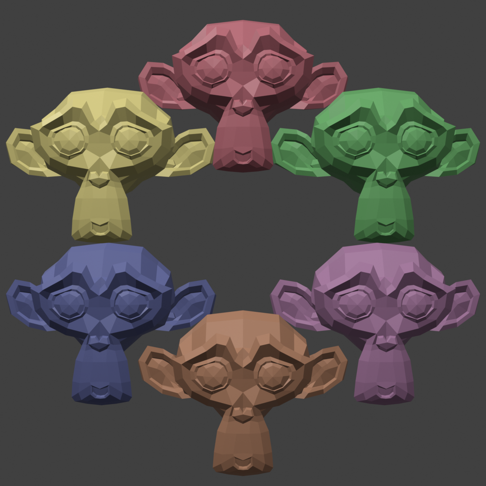

# BlenderArchipelago

A [Blender](https://www.blender.org) add-on for [Archipelago](https://archipelago.gg), a multiworld, multi-game randomizer.

## What is this?

Let's say I'm playing Blender, and my friend is playing Ocarina of Time. When I create a render that is similar enough to a target image, I find my friend's Hookshot, allowing them to reach several OoT chests they couldn't before. In one of those chests they find my Edit Mode, allowing me to make models with better precision. I create a more similar-looking render to a target image, and find my friend's Ocarina. This continues until we both find enough of our items to finish our games.

## What does randomization do to this game?
Many tools are locked from the start, leaving object mode as one of your only starting tools.
Render region size is locked and will only expand when the Progressive Render Width and Progressive Render Height items are
obtained.

Location checks are sent out based on similarity to a target image, measured as a percentage. Every percentage point up
to a maximum set in the game options will send a new check, and the game will be considered done when a certain target
percentage (set in the game options) is reached.

## Installation

### Prerequisites

- Make sure you have Blender 4.2.0 or above installed (Any version lower is not guaranteed to work.)
- Install the core Archipelago tools from [Archipelago's Github Releases page](https://github.com/ArchipelagoMW/Archipelago/releases). On that page, scroll down to the "Assets" section for the release you want, click on the appropriate installer for your system to start downloading it (for most Windows users, that will be the file called `Setup.Archipelago.X.Y.Z.exe`), then run it.
- Go to [the Releases page](https://github.com/GBFound/BlenderArchipelago/releases) of this repository and look at the latest release. Download the .zip, the .apworld and the .yaml.

### Archipelago tools setup

- Go to your Archipelago installation folder. Typically that will be `C:\ProgramData\Archipelago`.
- Put the `Blender.yaml` file in `Archipelago\Players`. You may leave the `.yaml` unchanged to play on default settings, or use your favorite text editor to read and change the settings in it.
- Double click on the `blender.apworld` file. Archipelago should display a popup saying it installed the apworld. Optionally, you can double-check that there's now an `blender.apworld` file in `Archipelago\custom_worlds\`.

#### I've never used Archipelago before. How do I generate a multiworld?

Let's create a randomized "multiworld" with only a single Blender world in it.

- Make sure `blender.yaml` is the only file in `Archipelago\Players` (subfolders here are fine).
- Double-click on `Archipelago\ArchipelagoGenerate.exe`. You should see a console window appear and then disappear after a few seconds.
- In `Archipelago\output\` there should now be a file with a name like `AP_95887452552422108902.zip`.
- Open https://archipelago.gg/uploads in your favorite web browser, and upload the output .zip you just generated. Click "Create New Room".
- The room page should give you a hostname and port number to connect to, e.g. "archipelago.gg:12345".

For a more complex multiworld, you'd put one `.yaml` file in the `\Players` folder for each world you want to generate. You can have multiple worlds of the same game (each with different options), as well as several different games, as long as each `.yaml` file has a unique player/slot name. It also doesn't matter who plays which game; it's common for one human player to play more than one game in a multiworld.

### Modding and Running Blender

- Open Blender and select "Edit" > "Preferences" > "Add-Ons". Open "Install from Disk" and select BlenderArchipelago.zip.
- Now in "View 3D" > "Sidebar" > "Blender AP", and you will be asked for connection info such as the hostname and port number. Unless you edited `blender.yaml` (or used multiple `.yaml`s), your slot/player name will be "Blenderer". And by default, archipelago.gg rooms have no password.
